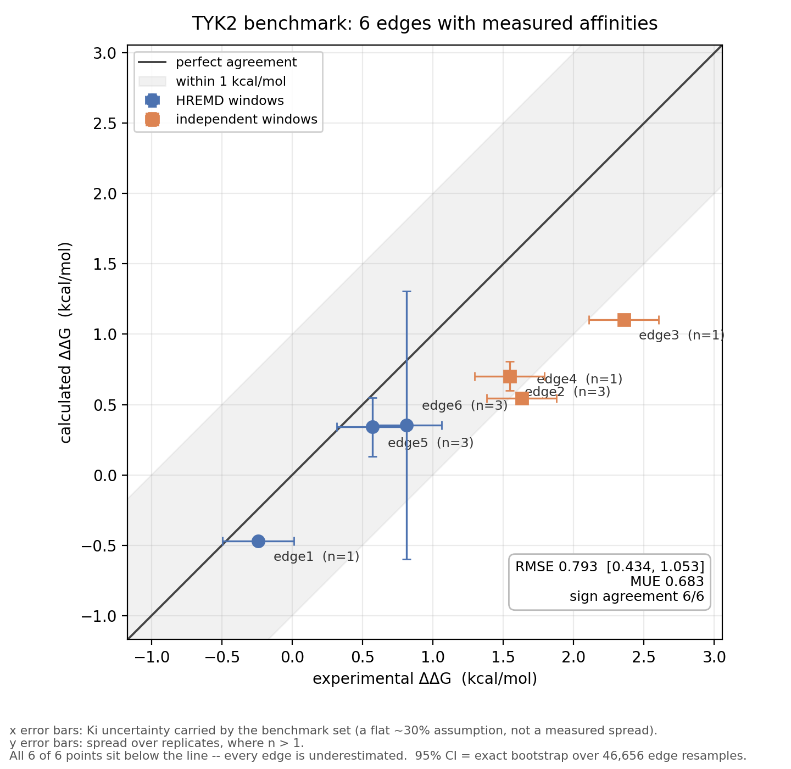
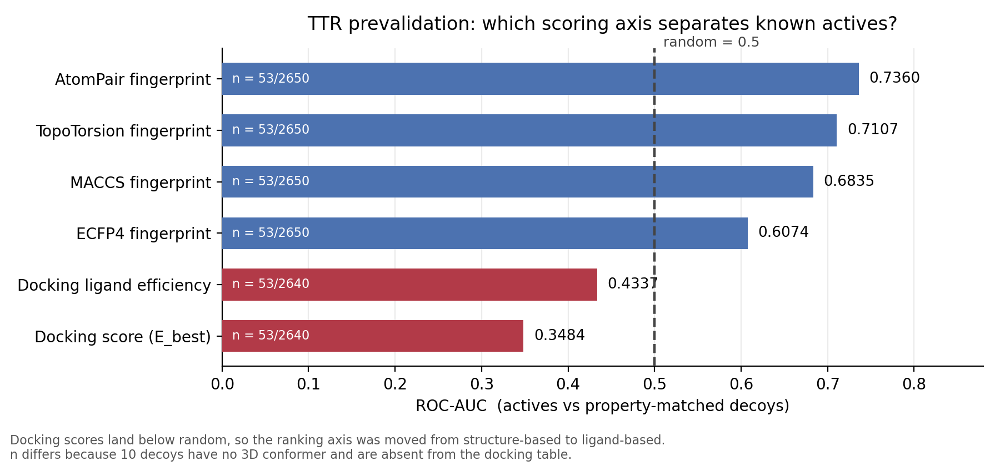
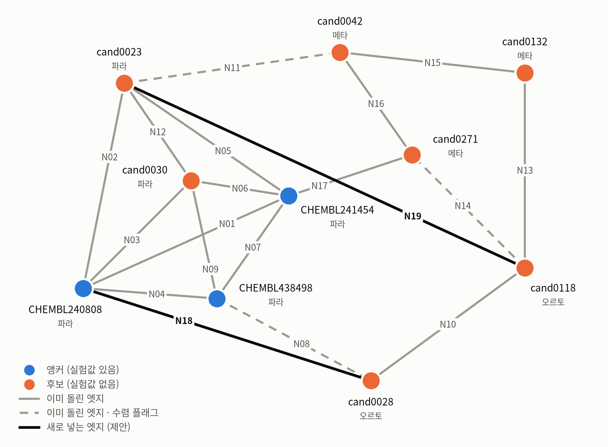

# TTR 사량체 안정화제를 FEP로 고르려 한 기록 — 파이프라인은 자격 검사를 통과했고, 본 시험은 통과하지 못했다

## 0. 한눈에

GROMACS 기반 알케미컬 자유에너지 파이프라인을 직접 구성해 실험값이 공개된 표적(TYK2)에서 자격 검사를 통과시킨 뒤 신규 표적(TTR)에 적용했고, 신규 표적에서는 사전 등록한 합격 기준을 통과하지 못해 후보 순위를 보고하지 않았습니다.


| | 값 | 근거 |
|---|---|---|
| 관문 1 — TYK2 자격 검사 | **RMSE 0.793 kcal/mol** (95% CI 0.434–1.053), 부호 일치 6/6 | [`edges_summary.csv`](01_tyk2_validation/results/edges_summary.csv) |
| 관문 2 — TTR 공시험 | **−3.87 ± 0.31 kcal/mol** (참값 0) → 사전 기준 최하 등급 | [`final_edges.json`](02_ttr_campaign/results/final_edges.json) |
| 판정 | **결합력 예측으로 후보 순위를 보고하지 않음** | [`FINAL_REPORT.md`](02_ttr_campaign/reports/FINAL_REPORT.md) |

**저장소 구성** — [`01_tyk2_validation/`](01_tyk2_validation/) 벤치마크 검증 · [`02_ttr_campaign/`](02_ttr_campaign/) 신규 표적(사전 등재 문서 포함) · [`03_prevalidation/`](03_prevalidation/) 지표 사전 검증 · [`figures/`](figures/). 궤적·에너지 파일은 용량 때문에 넣지 않았고, 수치를 뒷받침하는 설정·스크립트·결과표만 올렸습니다. 자세한 구성은 6-2에 있습니다.

---

## 1. 목표와 설계

### 1-1 무엇을 하려 했나

ATTR 아밀로이드증에서 TTR 사량체 해리를 막는 저분자 안정화제를 대상으로 했습니다. 생성 모델로 후보를 만들고, 그중 무엇을 합성 후보로 올릴지를 **상대결합 자유에너지(RBFE) 계산으로** 정하려 했습니다.

후보를 고르는 일에 FEP를 쓰려 한 이유는, 깔때기 앞단에 쓰는 도킹·QSAR과 **독립인 물리 기반 축**이 하나 필요했기 때문입니다. 앞단 지표들은 구조 유사성과 학습된 통계를 다른 방식으로 쓰는 것이어서, 그중 무엇이 맞는지를 그들끼리는 가릴 수 없습니다. 알케미컬 자유에너지는 그 축들과 독립이고 물리적 근거가 분명합니다. 다만 FEP는 비싸고 틀릴 수 있으므로, 쓰기 전에 그 파이프라인이 맞는 답을 내는지부터 확인하기로 했습니다.

### 1-2 왜 TYK2를 먼저 했나 — 관문 1의 정의

신규 표적에 쓰기 전에, **이 파이프라인이 맞는 답을 내는지 먼저 측정했습니다.**

실험 결합력이 공개된 표적에서 같은 파이프라인을 돌려 문헌 수준과 견주는 것을 **관문 1**로 두었습니다. 여기를 통과하지 못하면 신규 표적의 숫자는 읽을 이유가 없습니다. 관문 1의 결과가 2-1이고, 신규 표적에서의 자기 대조가 **관문 2**(3절)입니다.

### 1-3 결과를 보기 전에 선을 그었다 — 사전등재

계산을 시작하기 전에 판정 기준을 **사전 등재**하고, 추가만 허용하고 수정은 금지했습니다(변경 이력 59건, 2026-09-12 ~ 10-05). 결과를 본 뒤에 기준을 바꿀 수 없게 하기 위해서입니다. 원본은 [`prereg/prereg.json`](02_ttr_campaign/prereg/prereg.json)이고, 손대지 않았기 때문에 운영 기록까지 그대로 들어 있습니다.

**적용 범위를 분명히 해 둡니다.** 사전등재는 **FEP 판정 기준에만 적용됩니다.** 2-3의 깔때기 단계(생성 · 필터 · QSAR 순위 · 화학형 선별)는 2026-09-08까지 끝났고 사전등재 파일의 동결은 2026-09-12이므로, 깔때기 단계에는 사전등재가 없습니다.

---

## 2. 방법과 단계별 결과

### 2-1 관문 1 — 파이프라인 자격 검사 (TYK2)

**구성**

- 하이브리드 토폴로지: `pmx` (`atomMapping --H2Hpolar`, `ligandHybrid -pairs`, 매핑 육안 검증 스크립트 포함) — [`pmx/build_hybrids.sh`](01_tyk2_validation/pmx/build_hybrids.sh), [`pmx/verify_hyb5.py`](01_tyk2_validation/pmx/verify_hyb5.py)
- 샘플링: 6 엣지 중 **3 엣지는 λ-HREMD (24창, 레그 6/11/7)**, **3 엣지는 독립 창 (19창, 5/9/5)** — [`mdp/hremd_legs/`](01_tyk2_validation/mdp/hremd_legs/)
- soft-core: `sc-alpha 0.5` · `sc-power 1` · `sc-r-power 6` · `sc-sigma 0.3` · `sc-coul no` — [`mdp/fep_block.txt`](01_tyk2_validation/mdp/fep_block.txt)
- 분석: `alchemlyb` / `pymbar` — MBAR · BAR · TI 3종 병행, demux 후 상관시간 재계산 — [`analysis/`](01_tyk2_validation/analysis/)

**결과** — 표의 모든 값은 [`results/edges_summary.csv`](01_tyk2_validation/results/edges_summary.csv)에서 나오며, 그 파일은 회차별 원값에서 [`build_edges_summary.py`](01_tyk2_validation/analysis/build_edges_summary.py)가 만듭니다.

| 지표 | 값 |
|---|---|
| 실험값 보유 엣지 | 6 |
| RMSE | **0.793 kcal/mol** · 95% CI **0.434–1.053** |
| MUE | 0.683 kcal/mol |
| 부호 일치 | 6 / 6 |



참고 수준: Ross et al., *Commun. Chem.* **6**, 222 (2023) Table 3의 FEP+ 벤치마크는 Edgewise RMSE 1.17 / Pairwise RMSE 1.25 kcal/mol입니다. 위 0.793은 엣지 단위이므로 Edgewise와 같은 축입니다.

**이 숫자를 읽을 때 알아야 할 두 가지**

1. **혼합 프로토콜의 성적입니다.** HREMD 3 엣지와 독립 창 3 엣지를 합쳐 낸 값이고, 두 방식을 분리해 비교하지는 않았습니다.
2. **오차 6개가 모두 음수입니다.** 계통 편향의 가능성이 있으며, 이 데이터만으로는 원인을 특정하지 못했습니다.

**신뢰구간 산출** — 엣지가 6개뿐이라 재표집을 **전수 열거**(6⁶ = 46,656)해 정확한 구간을 냈습니다. 시드 고정 부트스트랩 10,000회도 같은 값이지만, 시드를 바꾸면 상한이 1.044–1.065로 흔들립니다. 재현 스크립트는 [`analysis/bootstrap_rmse_ci.py`](01_tyk2_validation/analysis/bootstrap_rmse_ci.py)에 있습니다.

**수렴 판정에 쓴 것** — 겹침 행렬([`overlap24.txt`](01_tyk2_validation/results/overlap24.txt)), 교환 수락률([`hremd_accept.txt`](01_tyk2_validation/results/hremd_accept.txt)), demux 워커 전환([`geff.json`](01_tyk2_validation/results/geff.json)), 정·역 방향 hysteresis([`s56_summary.txt`](01_tyk2_validation/results/s56_summary.txt)). 본계산 복합체의 **레그 평균** 수락률은 0.29–0.92 범위였고, 엣지별 전체 쌍 평균은 edge1 0.71 · edge5 0.75 · edge6 0.47입니다(각 엣지 1회차 로그 기준).

**같은 표적, 다른 스택** — OpenFE/OpenMM으로도 3 엣지 삼각형을 ×3회 반복해 완주했고 RMSE 0.160 kcal/mol, 고리 닫힘 0.017–0.433을 얻었습니다. 다만 **엣지가 3개뿐이고 단일 반복은 0.11–0.43으로 흩어집니다.** 별도 저장소 [`tyk2-fep-triangle`](https://github.com/Nudge92/tyk2-fep-triangle)에 있습니다.

전 계산값과 판정 전문은 [`TYK2_계산값_대장.md`](01_tyk2_validation/TYK2_계산값_대장.md) · [`TYK2_판정_요약.md`](01_tyk2_validation/TYK2_판정_요약.md)에 있습니다.

### 2-2 지표를 먼저 쟀다 — 쓸 축과 못 쓸 축

후보를 고르기 전에, 쓰려던 계산 지표가 **이 표적에서 실제로 판별력이 있는지** 측정했습니다. 활성물질 53종과 물성 정합 decoy 2,650종으로 벤치마크를 구성했습니다(도킹 채점은 3D 생성에 실패한 10종을 제외한 2,640종). 아래 값은 [`03_prevalidation/analysis/recompute_metrics.py`](03_prevalidation/analysis/recompute_metrics.py)를 돌리면 원표에서 그대로 재계산됩니다.

| 지표 | 판별력 | 판정 |
|---|---|---|
| 도킹 점수 | ROC-AUC **0.3484** (무작위 0.5) | 무작위 이하 — 순위 축에서 제외 |
| 리간드 유사도 (AtomPair) | ROC-AUC 0.7360 | 채택 |
| 골격 내 판별 지표 | 쌍 정확도 — 기준선과 **구분되지 않음** | 부트스트랩 신뢰구간이 0을 포함 |



근거: [`docking_scores.csv`](03_prevalidation/data/docking_scores.csv) · [`similarity_all_fp_v2.csv`](03_prevalidation/data/similarity_all_fp_v2.csv)

쌍 정확도는 쌍 집합과 집계 방식이 다른 여러 시험의 값이어서 숫자를 그대로 나란히 놓기 어렵습니다. 가장 큰 43쌍 시험에서 확정 순위축의 micro 정확도는 **0.628**로 중원자 수 단독 기준선보다 +0.093 높았지만, **골격 단위 부트스트랩 95% 신뢰구간이 [−0.111, +0.438]로 0을 포함**합니다. 다른 시험들도 같은 결론이었습니다 — 어느 쪽도 기준선과 구분되지 않습니다. 기준선은 중원자 수 단독이며, 분자량 단독은 0.762입니다. 쌍별 원표는 [`scaffold_pairs.csv`](03_prevalidation/data/scaffold_pairs.csv)(43쌍) · [`diphenylether_pairs.csv`](03_prevalidation/data/diphenylether_pairs.csv)(21쌍) · [`benzophenone_pairs.csv`](03_prevalidation/data/benzophenone_pairs.csv)(8쌍)입니다.

이 결과로 깔때기의 **순위 지표를 구조 기반에서 리간드 기반으로 교체**했습니다(AtomPair + 물성 L1 Borda, AUC 0.735).

1-1에서 적은 "도킹·QSAR과 독립인 물리 기반 축이 필요하다"는 설계 시점의 판단은 여기서 측정으로 뒷받침됐습니다 — 구조 기반 축은 이 표적에서 무작위 이하였습니다.

이 축은 `ef/consensus_rank.py`(2026-09-07 00:55)로 집행돼 `clustered_18167.csv`(2026-09-08 02:53)에 실렸습니다. 사전검증이 순위축 결정보다 앞선다는 선후는 파일 시각으로 확정됩니다.

한 가지 더 — 포즈 안정성 지표는 사후 관찰(8쌍)에서 쌍 정확도 0.875였으나, 판정 기준을 사전 고정한 시험(21쌍)에서 **0.524로 재현되지 않았습니다.** 쌍 집합이 다르므로 "악화"가 아니라 "재현 실패"입니다.

### 2-3 후보 설계 — 58,940에서 7로

생성 수용체는 **6E72 생물학적 사량체**이고 포켓은 **site A**입니다. 생성 모델 3종(DiffSBDD · Pocket2Mol · REINVENT)으로 58,940종을 설계했습니다. 세 모델의 골격 중복은 Jaccard 0.030–0.056으로, 서로 다른 화학 공간을 탐색했습니다.

```
생성 58,940          DiffSBDD 18,867 · Pocket2Mol 20,073 · REINVENT v1 20,000
  ↓ 사전필터 (파싱·sanitize → actives 복사 제거 → 최대고리 ≤8 → SA ≤3.5 → Lipinski ≤1)
20,564
  ↓ 내부 중복 제거 (입체 무시 InChIKey)
18,864
  ↓ Butina 군집 ECFP4 ≥0.8        ← 군집화는 분류가 아니라 필터입니다
18,167
  ↓ QSAR 합의 순위 (Tox24 9종 → 대표 3종 Borda)
상위 300
  ↓ 화학형 (Murcko 디페닐에터 ∩ 카복실산)
8
  ↓ 전하 배제
7
```

**QSAR 순위** — 표적 활성 데이터가 부족해 공개 결합 치환 데이터(Tox24 Challenge)로 모델 9종(기술자 3안, 사전 선언)을 학습했고, 그중 3종(Ridge · KRR · RF — 선형·커널·트리 세 모델 계열이며 기술자는 2종)의 Borda 합의 순위로 18,167개 전체에 점수를 매겼습니다. `cand####`의 번호가 그 합의 순위 자체입니다. 모델 선언은 [`model_loso.py`](02_ttr_campaign/qsar_selection/model_loso.py), 이름을 붙인 코드는 [`dock_targets.py`](02_ttr_campaign/qsar_selection/dock_targets.py)에 있습니다.

**화학형 선별** — 상위 300 중 Murcko 골격이 디페닐에터이고 카복실산을 가진 분자를 남겨 8개가 됐습니다. 이 조건은 모델이 아니라 외부 지식에서 왔습니다 — 카복실산은 승인약 3종이, 디페닐에터는 앵커 9개가 근거입니다.

**모델이 얼마나 좁혔는가** — 18,167개 중 화학형 조건(디페닐에터 ∩ 카복실산)만 만족하는 것이 **118개**입니다(디페닐에터 골격 전체는 283개). 그 118개의 QSAR 순위는 최소 12 · 중앙 1,649 · 최대 11,101이고, 상위 1,000 안에 39개 · 상위 3,000 안에 95개가 듭니다. 화학형 조건만으로 118개가 남습니다. QSAR 상위 300이 그중 8개를 집었으므로 모델이 무작위로 고른 것은 아니지만, **후보를 모델이 발견했다고는 할 수 없습니다.** 좁힌 것은 모델이고 화학형을 정한 것은 승인약 3종과 앵커 9개라는 외부 지식입니다.

**8에서 7로** — 합의 순위 **1위인 cand0012**가 COOH 2개로 q = −2가 되어 전하 −1층 그물에서 배제됐습니다(`PROTONATION_0B_20260921.md:31` · `cand_param.py:13` · `N17_ADDED_EDGE_20260927.md:19`).

### 2-4 후보를 고른 축이 목표 축으로 가지 않았다 — 외부 검증 0/9

후보 선정이 끝난 뒤, **대리 지표가 실제 목표 축으로 전이되는지** 따로 측정했습니다. 근거는 [`D_external.json`](02_ttr_campaign/qsar_selection/D_external.json) · [`tox24_external.py`](02_ttr_campaign/qsar_selection/tox24_external.py)입니다.

| | |
|---|---|
| 학습 축 | Tox24 결합 치환 % (n = 873 방향족 / 1,500 전체) |
| 평가 축 | 피브릴 억제 pIC50 (실측 보유 64종, 4.96–6.56) |
| 결과 | **0 / 9** — 9개 모델 전부 Spearman ρ의 신뢰구간이 0을 포함 |
| 데이터 누수 | InChIKey 겹침 **0** |

즉 **후보를 고른 축이 목표 축으로 전이된다는 근거가 없습니다.** 이것은 3-1의 FEP 공시험 실패와는 별개의, 더 상류에 있는 한계입니다.

두 가지를 덧붙여 둡니다. 모델을 빼고 실측끼리만 봐도 두 축의 연결이 보이지 않아, 전이 실패를 모델 탓으로만 돌릴 수는 없습니다. 그리고 외부셋에 대한 예측이 학습 분포보다 한쪽으로 쏠려 있었습니다(예측 중앙 63–90 % 대 학습 분포 중앙 47.1 %).

반대 방향의 관찰도 하나 남깁니다. **같은 9종 모델·같은 설계·같은 코드**로 학습 엔드포인트만 직접 결합상수(N = 59)에서 피브릴 억제 pIC50(N = 151)으로 바꾸자, 내부 교차검증에서 유의한 양의 상관을 보인 모델이 **0/9에서 2/9로** 늘었습니다(BH-FDR q = 0.003). 다만 **단순 기준선을 유의하게 넘은 모델은 세 데이터셋 모두 0/9**였습니다. 움직인 것은 모델이 아니라 데이터였지만, 그 움직임도 기준선을 넘지는 못했습니다. (이 비교에 Tox24는 들어가지 않습니다 — 위 외부 검증과는 다른 실험입니다. 대조표는 [`A3_summary_endpoint_switch.md`](02_ttr_campaign/qsar_selection/A3_summary_endpoint_switch.md) §5에 있습니다.)

### 2-5 섭동 네트워크 — 10노드 17엣지

엣지 목록은 [`edges_v7.txt`](02_ttr_campaign/network/edges_v7.txt)(N01~N16)와 [`edges_v12_add.txt`](02_ttr_campaign/network/edges_v12_add.txt)(N17)입니다.

- 설계 후보 7종 + 실험 결합력 보유 화합물 3종 (노드 10)
- **17 엣지** — N01~N16(1차 그물) + N17(별도 프로토콜로 추가)
- 엣지당 독립 반복 3–5회 (N01 3회 · N08·N14 4회 · 나머지 5회) — [`B1_ddg_per_rep.tsv`](02_ttr_campaign/results/B1_ddg_per_rep.tsv)



---

## 3. 관문 2 — FEP는 무엇을 냈나

### 3-1 공시험 N01

사전등재한 기준 중 하나가 **공시험(blank test)** 입니다. 실험 결합력이 서로 같은 두 화합물(27.0 nM, 동일 어세이·동일 문서)을 네트워크에 넣고, 계산이 0에 가까운 ΔΔG를 내는지 봤습니다. **통과하지 못했습니다.**

| | 값 |
|---|---|
| 사전 등재한 합격선 (09-16 등재본 · 판정 근거) | \|ΔΔG\| ≤ 0.5 통과 · 0.5–1.0 보류 · > 1.0 실패 · **> 2.0 "ΔΔG를 발표하지 않는다"** |
| 공시험 실측 (N01) | **−3.87 ± 0.31** kcal/mol (3회차: −4.22 / −3.75 / −3.63) — 최하 등급. 채점 방식을 바꾸면 −4.64까지 0.77 벌어지며, 어느 쪽이든 실패 |

근거: 합격선 [`prereg.json`](02_ttr_campaign/prereg/prereg.json) `fep_null_test_v9` · 실측 [`final_edges.json`](02_ttr_campaign/results/final_edges.json)과 회차별 [`c6_raw_v13.json`](02_ttr_campaign/results/c6_raw_v13.json)

### 3-2 앵커 대조와 고리 닫힘

아래 RMSE와 고리 닫힘은 N17을 뺀 **16 엣지 그물 기준**입니다.

앵커 3엣지 실험 대조 RMSE는 **2.93 kcal/mol**입니다(같은 축의 문헌 수준: Edgewise 1.17). 근거는 [`headline_two_rows.json`](02_ttr_campaign/results/headline_two_rows.json)입니다.

**고리 닫힘** — 7개 고리의 닫힘 RMS는 **5.44**이고, 최악 고리 하나(4엣지, 닫힘 −13.77, **5.54σ**)를 제외하면 **1.71**로 내려갑니다. 앵커 삼각형은 **0.65σ**(+0.75 ± 1.15)로 닫혔습니다. 세 값을 함께 적는 이유는, 앵커 삼각형만 인용하면 유리한 고리만 고른 셈이 되기 때문입니다. 고리별 값은 [`E2_cycles.tsv`](02_ttr_campaign/network/E2_cycles.tsv), 분석 전문은 [`CYCLES.md`](02_ttr_campaign/reports/CYCLES.md)에 있습니다.

### 3-3 합격선 판본 셋 — 결과 전에 정해진 것은 09-16뿐

합격선은 판본이 셋입니다. **09-16 등재본**(0.5 / 1.0 / 2.0 눈금, "> 2.0이면 ΔΔG를 발표하지 않는다"), **09-20 동결본**([`TTR_FEP_CONTROL.md`](02_ttr_campaign/prereg/TTR_FEP_CONTROL.md) F-6 — 1.0 / 2.0 눈금, "계산을 버리지 않고 널 값을 분해능 하한으로 선언"), 그리고 **10-04 재정**(`prereg.json` 변경 이력 v34 — "둘 다 적고 판정은 등재 문구로 한다")입니다.

★ 이 중 **결과를 보기 전에 정해진 것은 09-16 등재본뿐입니다.** 09-20 동결본은 09-17 파일럿 값(−2.420)을 본 뒤에 정해졌습니다. 그래서 판정은 09-16 문구로 하고, 10-05 마감 보고서도 그 문구로 등급을 매겼습니다([`FINAL_REPORT.md`](02_ttr_campaign/reports/FINAL_REPORT.md) §3). 어느 판본으로 봐도 −3.87은 최하 등급입니다.

★ 한 가지 더 — 공시험 두 화합물의 27.0 nM은 TTR 첫 번째 결합자리(Kd1) 값입니다. 두 번째 자리(Kd2)로 바꾸면 이 쌍의 오차가 −1.047로 줄어듭니다([`EXPT_LEDGER_AUDIT_20260921.md`](02_ttr_campaign/prereg/EXPT_LEDGER_AUDIT_20260921.md)). 참값이 0이라는 전제 자체가 결합자리 선택에 달려 있고, 이것도 미결로 남아 있습니다.

---

## 4. 진단 — 배제한 것과 남은 것

실패를 "안 됐다"로 두지 않고, 가능한 원인을 하나씩 잘라냈습니다.

### 4-1 잘라낸 원인

| 후보 원인 | 판정 | 근거 |
|---|---|---|
| 결정수 처리 | **배제** | 결합부 4.5 Å 이내 결정수 0개(전수 204개, 최단 5.58 Å — [`site_occupancy.tsv`](02_ttr_campaign/results/site_occupancy.tsv)). 포함 조건 재실행에서 −3.34 ± 0.66 — 값은 움직였으나 **판정은 불변**(N01만 완주 — [`X3_summary.tsv`](02_ttr_campaign/results/X3_summary.tsv)) |
| 추정기의 통계 오차 | **배제에 가까움** | N17 엣지에서 MBAR 해석적 σ 0.029 대 회차 간 표준편차 0.908 — 추정기의 통계 오차가 회차 간 산포의 1/31 수준(31.3배 차). [`uq1_prod_v14_N17.json`](02_ttr_campaign/results/uq1_prod_v14_N17.json) |

### 4-2 남은 원인

| 후보 원인 | 판정 | 근거 |
|---|---|---|
| 샘플링 길이 | **미결** | N17 엣지에서 2 ns +1.768([`ddg_prod_v12f_N17.json`](02_ttr_campaign/results/ddg_prod_v12f_N17.json)) 대 8 ns +1.522, 차이 0.246이 길이 효과인지 시드 차이인지 닫지 못함 |
| 결합 자세 모호성 | **잔여** | TTR은 정·역 두 배향이 결정구조에서 모두 관찰되는 표적 |
| 양성자화 상태 | **잔여** | — |
| 리간드 파라미터 | **잔여** | — |

### 4-3 고리 분석이 지목한 그물의 약점

3-2의 고리 닫힘 분석으로 **고리 하나에만 속해 교차검증이 불가능한 엣지**를 특정했습니다 — 기저 고리 7개 기준으로는 8개이고, 재설계 기준(길이 5 이하 고리)으로는 4개(N08·N10·N13·N15)입니다. 모든 엣지가 길이 5 이하 고리 2개 이상에 포함되도록 **19 엣지 재설계안**을 도출했습니다([`design.json`](02_ttr_campaign/network/design.json) · [`NETWORK_REDESIGN_REPORT.md`](02_ttr_campaign/reports/NETWORK_REDESIGN_REPORT.md)). 설계만 했고 시뮬레이션은 돌리지 않았습니다.

### 4-4 가장 큰 설계 실수

결합 자세를 **충돌 개수로 골랐고, 결정구조와 맞는지 확인하지 않았습니다.** TTR은 정방향/역방향 결합 모호성이 보고된 표적이고(Ortore 2017이 교차 도킹 RMSD 3.8 Å으로 정량 — 채점 함수 6종 중 최선의 평균이며 범위는 3.8–5.4 Å. Palaninathan 2012는 T4 복합체 14개 중 12개가 정방향, 2개가 역방향이라고 보고), 그 문헌을 계산이 끝난 뒤에 읽었습니다.

**표적 문헌을 계산 전에 읽었어야 했습니다.** 이것이 이 캠페인에서 가장 값비싼 교훈입니다.

---

## 5. 결론 — 무엇을 보고하고 무엇을 보고하지 않는가

**공시험이 사전 등재한 문턱을 넘지 못했으므로, 후보 순위를 실제 결합력 순서로 주장하지 않았습니다** — 09-16 등재본의 문구에 따른 판정입니다. 아울러 공시험 값을 이 계의 분해능 하한(약 3.9 kcal/mol)으로 선언했습니다. 다만 이 "분해능 하한"이라는 처리 자체는 09-20 동결본의 문구이고, 그 판본은 결과를 본 뒤에 정해졌습니다(3-3). 순위표 자체는 마감 보고서에 실려 있습니다 — 계산을 버린 것이 아니라, 이 방법이 이 계에서 구분할 수 있는 최소 차이가 3.9이고 후보들의 예측 차이는 그보다 작다는 뜻입니다. 보고서에는 "이 보고서가 주장하지 않는 것" 절을 두고 후보의 실제 결합력 순서를 첫 항목에 올렸습니다([`FINAL_REPORT.md`](02_ttr_campaign/reports/FINAL_REPORT.md) §5).

결과가 음성이면 보통 기록이 남지 않습니다. 남겨 둡니다. **같은 파이프라인이 한 표적에서는 문헌 수준으로 맞고 다른 표적에서는 자기 공시험을 통과하지 못한다는 것**이, 자유에너지 계산을 실제로 쓸 때 알아야 할 사실이기 때문입니다.

이 저장소에서 보실 수 있는 것:

- 쓰기 전에 도구를 먼저 재는 절차 (벤치마크 사전 검증)
- 결과를 보기 전에 합격선을 박아 두는 절차 (사전 등재, append-only)
- 자기 계산을 반증할 수 있게 설계한 대조 (공시험)
- 통과하지 못했을 때 보고를 멈추는 판단

---

## 6. 재현과 부록

### 6-1 환경

```
GROMACS — TYK2 및 TTR N17: 2026.3 / TTR 16엣지 프로덕션: 2025.2
GPU     — TTR 16엣지 프로덕션: A40 ×3 / TYK2 및 N17: RTX 4060 Ti ×1
pmx · alchemlyb · pymbar · LOMAP
GAFF2 / AM1-BCC · TIP3P 명시적 용매
```

실행 설정은 [`01_tyk2_validation/mdp/`](01_tyk2_validation/mdp/)와 [`02_ttr_campaign/mdp/`](02_ttr_campaign/mdp/)에 있습니다. 스크립트 안의 절대경로는 실행 당시 그대로이며, 재현하려면 수정이 필요합니다.

### 6-2 저장소 구성

[`01_tyk2_validation/`](01_tyk2_validation/) 벤치마크 검증 · [`02_ttr_campaign/`](02_ttr_campaign/) 신규 표적(사전 등재 문서 포함) · [`03_prevalidation/`](03_prevalidation/) 지표 사전 검증 · [`figures/`](figures/). 각 폴더에 그 폴더가 무엇인지 적은 README가 있습니다. 궤적·에너지 파일은 용량 때문에 넣지 않았고, 수치를 뒷받침하는 설정·스크립트·결과표만 올렸습니다.

### 6-3 발표

대한약학회 80주년 기념 국제학술대회(2026.10.23–25) 포스터 발표 — **2026.10.24**

Discovery of transthyretin tetramer stabilizers by generative design with free energy based final selection

제출 초록은 전하 0층 12노드·19엣지 그물 기준이고, 최종 캠페인은 실험값 보유 앵커를 확보할 수 있는 전하 −1층 10노드·17엣지로 옮겨 갔습니다. 두 그물은 분자가 하나도 겹치지 않습니다. 그물 교체는 공시험 판정보다 엿새 앞선 결정이며, 배경에는 학습 엔드포인트를 직접 결합에서 피브릴 억제로 바꾼 전환이 있습니다.

### 6-4 참고 문헌

- Ross et al., *Commun. Chem.* **6**, 222 (2023) — FEP+ 대규모 벤치마크 (Table 3: Edgewise 1.17 · Pairwise 1.25)
- Mey et al., *LiveCoMS* **2**, 18378 (2020) — 알케미컬 자유에너지 모범 관행
- Procacci, *Molecules* **27**, 4426 (2022) — λ-hopping HREMD의 한계
- Hui & de Groot, *JCTC* (2026) — 교환 기반 프로토콜의 RBFE 정확도
- Ortore et al., *ChemMedChem* (2017); Palaninathan (2012) — TTR 결합 배향

### 6-5 미확인 항목

- **58,940 → 20,564의 단계별 절대 수** — 모델별 통과율(%)만 기록돼 있고 각 단계 잔존 수는 남아 있지 않습니다.
- **DiffSBDD 생성 설정 파일** — 찾지 못했습니다. Pocket2Mol(`generation/configs/p2m_ttr_siteA.yml`)과 REINVENT(체크포인트 `ckpt_step150.chkpt` · seed 20260907)는 남아 있습니다.
- **prereg에 순위축 교체 등재 없음** — 깔때기가 사전등재(09-12)보다 앞섰기 때문으로 보이나, "왜 등재하지 않았는가"의 기록은 없습니다.
